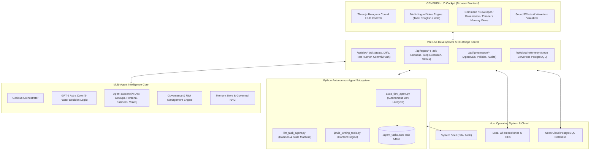

# ⚡ GENISUS — Personal AI Operating System & Command Center

<div align="center">


[](https://vitejs.dev/)
[](https://threejs.org/)
[](https://python.org/)
[](https://github.com/sathishkhan27/Genisus-Personal-AI-Operating-System)
[](LICENSE)

<br/>

**A Sci-Fi Inspired, Multi-Agent Autonomous Command Cockpit & Private AI Operating System.**  
*Powered by GPT-6 Astra Reasoning, Real-Time Git Bridges, Multi-Lingual Speech Engine, and Enterprise AI Governance.*

[Key Features](#-key-features) • [System Architecture](#-system-architecture) • [Getting Started](#-getting-started) • [Subsystems](#-core-subsystems) • [API Reference](#-api--bridge-reference) • [Stark Protocols](#-stark-protocols)

</div>

---

## 🌌 Overview

**GENISUS** is an autonomous Personal AI Operating System designed as an immersive cockpit and orchestration command center. Inspired by the intelligence workflows of JARVIS and FRIDAY, GENISUS bridges high-level natural language directives with real-world operating system execution, active development pipelines, real Git management, enterprise AI safety governance, and persistent autonomous agent swarms.

Whether running local code generation cycles, monitoring live PostgreSQL database instances on Neon Cloud, managing multi-lingual voice conversations, or dispatching tasks across autonomous agents, GENISUS provides zero-latency visibility and granular human-in-the-loop control.

---

## ✨ Key Features

- **🖥️ Sci-Fi Holographic Command HUD**
  - WebGL / Three.js 3D Hologram Core with interactive Arc Reactor mechanics and particle fields.
  - Real-time hardware telemetry gauges (CPU, Memory, Disk) and audio waveform visualizer.
  - CRT scanlines, CRT flicker, ambient vignette, and cinematic sci-fi sound effects.

- **🧠 GPT-6 Astra Reasoning Engine**
  - **6-Factor Decision Framework**: `Intent` ➔ `Confidence` ➔ `Risk Assessment` ➔ `Authorization` ➔ `Reversibility` ➔ `Autonomous Action`.
  - **Tri-Mode Operational Control**:
    - **Mode A (Advisory)**: Analysis, suggestions, and read-only diagnostics; zero state modifications.
    - **Mode B (Assisted)**: Codes, compiles, runs tests, stages Git commits, and requests operator sign-off before push.
    - **Mode C (Autonomous)**: Full end-to-end self-directed software development, repair, and Git deployment.

- **🤖 Autonomous Multi-Agent Swarm**
  - **AI Developer Agent (AGY)**: Full-stack code synthesis, multi-project file manipulation, and automated testing.
  - **DevOps Agent**: CI/CD build execution, test runner monitoring, and environment checks.
  - **Business & Revenue Agents**: Market dynamics tracking, financial telemetry, and growth indicators.
  - **Product Vision & Automation Agents**: Roadmap planning, macro task chaining, and background cron loops.
  - **LLM Background Worker Daemon**: Independent Python process managing persistent task states in `.agent_tasks.json`.

- **🛡️ Enterprise AI Governance & Safety Guardrails**
  - **Policy Engine**: Fine-grained access control and security rule verification.
  - **Approval Engine & Workflow Engine**: Cryptographic verification for elevated actions and reversible rollback checkpoints.
  - **Risk Scoring & Audit Logs**: Continuous risk computation and tamper-evident event streaming.
  - **Governed RAG Engine**: Retrieval-Augmented Generation guarded by compliance boundaries.

- **🎙️ Multi-Lingual Continuous Voice Engine**
  - Native speech recognition and high-fidelity vocal synthesis in **தமிழ் (Tamil)**, **English (US)**, **हिंदी (Hindi)**, **తెలుగు (Telugu)**, **ಕನ್ನಡ (Kannada)**, and **മലയാളം (Malayalam)**.
  - Continuous listening mode with hands-free trigger commands and hotword sensitivity.

- **🔌 Real Git & IDE Bridge**
  - Deep system integration with local repositories: detect branch status, unstaged diffs, and commit history.
  - One-click launch into IDEs (VS Code, Cursor, Android Studio).
  - Built-in Git staging, automated semantic commit generator, and remote GitHub pushing.

- **🧩 Tools, MCP Gateway & Skills Marketplace**
  - Model Context Protocol (MCP) tool routing and dynamic schema discovery.
  - Built-in directory of 18+ agentic capabilities and 16+ installable specialist agents.

---

## 🏛️ System Architecture



---

## 📁 Repository Structure

```
Genisus-Personal-AI-Operating-System/
├── index.html                 # Main Sci-Fi Cockpit HTML & HUD interface
├── package.json               # Node.js project manifest & scripts
├── vite.config.js             # Vite configuration with embedded OS & Git Bridge APIs
├── public/                    # Static assets, icons, audio soundscapes
├── python/                    # Autonomous Python Agent Subsystem
│   ├── astra_dev_agent.py     # 7-stage autonomous AI developer engine & Git runner
│   ├── llm_task_agent.py      # Background worker daemon & task queue state machine
│   ├── jarvis_writing_tools.py# Content enhancement & writing tool utilities
│   ├── requirements.txt       # Python dependencies (zero mandatory requirements)
│   ├── test_agent.py          # Unit & integration tests for Astra agent
│   └── test_llm_agent.py      # Test suite for LLM task agent
└── src/
    ├── main.js                # Core frontend bootstrapping & telemetry controllers
    ├── assets/                # Audio cues, UI icons, branding marks
    ├── styles/                # Sci-Fi HUD stylesheets (hud.css, responsive grids)
    └── modules/               # Modular Subsystem Architecture
        ├── agents/            # Multi-agent implementations & Stark protocols
        ├── audio/             # Sound effects & synthetic acoustic feedback
        ├── automation/        # Self-healing pipelines & autonomous verification
        ├── cloud/             # Cloud telemetry (Neon Serverless PostgreSQL)
        ├── governance/        # Policy, Approval, Risk & Audit controllers
        ├── intelligence/      # GPT-6 Astra, dynamic dialogue, task planner
        ├── knowledge/         # Governed RAG engine & local knowledge base
        ├── memory/            # Persistent memory stores & semantic index
        ├── skills/            # Agentic skills feeds & dynamic tools
        ├── tools/             # MCP (Model Context Protocol) gateway
        ├── visuals/           # Three.js holographic reactor & audio visualizers
        └── voice/             # Web Speech recognition & synthesis engine
```

---

## 🚀 Getting Started

### 1. Prerequisites
- **Node.js**: v18.0.0 or higher
- **npm**: v9.0.0 or higher
- **Python**: v3.9 or higher (standard library only; no virtualenv required)
- **Git**: Installed and configured on your host system

### 2. Installation

Clone the repository and install frontend dependencies:

```bash
# Clone the repository
git clone https://github.com/sathishkhan27/Genisus-Personal-AI-Operating-System.git
cd Genisus-Personal-AI-Operating-System

# Install Node.js packages
npm install
```

### 3. Launching the Command Center

Start the Vite development server with the integrated OS and Git API Bridge:

```bash
npm run dev
```

Open your browser at:
```
http://localhost:5173
```

---

## ⚙️ Core Subsystems

### 1. The Autonomous Developer Pipeline (`astra_dev_agent.py`)
Executes an end-to-end 7-stage development lifecycle:
1. **Directives Ingestion**: Analyzes requirements and parses intent.
2. **Context Discovery**: Scans target files, ASTs, and dependencies.
3. **Synthesis & Modification**: Edits JavaScript, Python, Dart, HTML/CSS directly.
4. **Verification & Testing**: Runs project test suites and captures stderr/stdout metrics.
5. **Self-Healing Loop**: Analyzes tracebacks, modifies code, and re-runs tests until green.
6. **Git Staging & Commit**: Produces conventional commit messages based on unified diffs.
7. **Safe Remote Push**: Deploys to GitHub (auto in Mode C, gated in Mode B).

```bash
# Run Astra Dev Agent directly from CLI
python3 python/astra_dev_agent.py --mode MODE_B_ASSISTED --task "Refactor telemetry ping utility"
```

### 2. Background Task Daemon (`llm_task_agent.py`)
Maintains an atomic task queue on disk (`python/.agent_tasks.json`) and handles asynchronous step-by-step executions:

```bash
# Start background worker daemon
python3 python/llm_task_agent.py --daemon

# Or enqueue and step through tasks programmatically
python3 python/llm_task_agent.py --enqueue "Audit governance approval rules"
python3 python/llm_task_agent.py --step
```

### 3. Enterprise AI Governance
Every agent request passes through the **Governance Controller**:
- Evaluates risk score (Low, Medium, High, Critical).
- Checks active security policies in `policyEngine.js`.
- If an operation touches external network destinations or deletes files, the **Approval Engine** generates a cryptographic pending ticket awaiting commander authorization.

---

## 🛡️ Stark Protocols

The Command Center includes high-priority override protocols accessible directly from the HUD sidebar:

| Protocol | Action | Description |
|---|---|---|
| ⚡ **HOUSE PARTY** | Swarm Concurrent Execution | Mobilizes all 6 specialist agents simultaneously to tackle large composite objectives. |
| 🎯 **TACTICAL VERONICA** | Combat Telemetry Overlay | Activates high-visibility diagnostic HUD displaying system memory ceilings, I/O rates, and model latency. |
| 🧹 **CLEAN SLATE** | Memory & Buffer Purge | Flushes ephemeral cache, resets conversation context, and re-initializes agent memory buffers. |

---

## 📡 API & Bridge Reference

The Vite server hosts an internal REST bridge for local system commands:

| Endpoint | Method | Description |
|---|---|---|
| `/api/dev/real-projects` | `GET` | Discovers registered projects on local storage with live Git branches. |
| `/api/dev/git-status` | `GET` | Fetches status, untracked files, and unstaged modifications for a project. |
| `/api/dev/git-diff` | `GET` | Returns colorized unified Git diff of unstaged changes. |
| `/api/dev/open-ide` | `POST` | Opens the target project in VS Code, Cursor, or Android Studio. |
| `/api/dev/run-test` | `POST` | Executes project test suites (`npm test`, `pytest`, `flutter test`). |
| `/api/dev/git-commit` | `POST` | Stages modified files and creates conventional commits. |
| `/api/dev/git-push` | `POST` | Pushes local branch commits to the remote GitHub repository. |
| `/api/agent/tasks` | `GET` | Returns full list of queued, in-progress, and completed background tasks. |
| `/api/agent/enqueue` | `POST` | Submits a new autonomous directive to the background worker queue. |
| `/api/agent/step` | `POST` | Triggers sequential execution of the next task in queue. |
| `/api/cloud-telemetry` | `GET` | Reads health metrics and database schema info from Neon Cloud PostgreSQL. |
| `/api/governance/status` | `GET` | Returns active policy compliance status and risk metrics. |

---

## 🛠️ Tech Stack

- **Frontend Core**: Vanilla Modern JavaScript (ES Modules), HTML5 Semantic Cockpit, CSS3 Custom Properties.
- **Visuals & 3D**: [Three.js](https://threejs.org/) for holographic rendering and WebGL shaders.
- **Icons & UI**: [Lucide Icons](https://lucide.dev/), Canvas Confetti.
- **Build Tool**: [Vite](https://vitejs.dev/) with customized Node.js middleware.
- **Agent Engines**: Python 3 standard library (`subprocess`, `json`, `pathlib`, `re`).
- **Cloud Infrastructure**: [Neon](https://neon.tech/) Serverless PostgreSQL telemetry.

---

## 👤 Author & Credits

- **Architect & Commander**: **Sathish S** ([@sathishkhan27](https://github.com/sathishkhan27))
- **System**: GENISUS Personal AI Operating System (v3.0.0)

---

## 📜 License

This project is licensed under the [MIT License](LICENSE) — free to use and extend for personal and open-source autonomous agent research.
